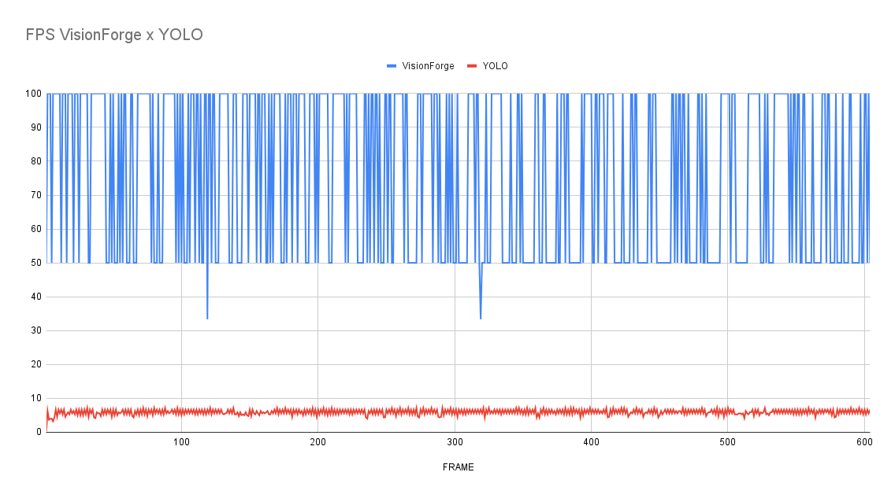
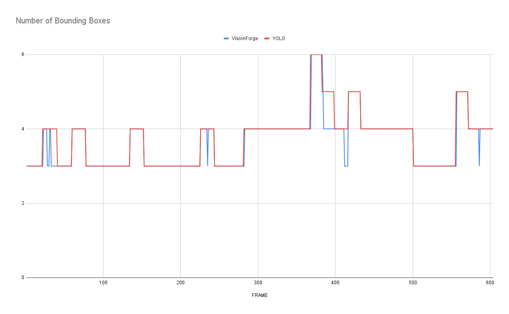

# VisionForge

Este projeto visa a criação de uma técnica para otimizar o tempo de processamento no rastreamento de objetos, utilizando
visão computacional.

O sistema consiste em empregar duas tecnologias para a detecção de objetos: YOLOv8 e OpenCV. O conceito é utilizar o
YOLO em um loop com um intervalo de tempo determinado em uma thread, enquanto o OpenCV é utilizado para detectar objetos
em tempo real. Em outras palavras, o YOLO (com alto custo de processamento) é executado a cada X
intervalo de tempo para a detecção de objetos, e os resultados são então enviados para o OpenCV, que opera em tempo
real para realizar o Tracking.


# Teoria

O YOLO, por ser uma tecnologia que demanda considerável poder de processamento, foi incorporado neste projeto como um
ajuste no método de Template Matching (OpenCV), o qual requer baixo processamento. Dessa forma, o YOLO é utilizado para
a detecção, enquanto o OpenCV realiza o rastreamento do objeto.

O YOLO gera caixas delimitadoras armazenadas em variáveis compartilhadas. Essas caixas são, então, repassadas para o
OpenCV como imagens de template. A partir dessas delimitações, também são geradas as Larger Images, que são ajustadas
com base nas configurações e variáveis: [HORIZONTAL_EXPANSION]() e [VERTICAL_EXPANSION](). Essas imagens representam
onde ocorre
a detecção. Isso assegura um alto desempenho, mesmo no Template Matching, devido à menor área de detecção em comparação
com o frame original.


O tempo de execução de cada ciclo do YOLO é determinado pela variável [yolo_period](). Esse intervalo pode ser
configurado
manualmente ou definido automáticamente como a média do tempo de processamento do modelo em seu computador. Esse tempo
impacta principalmente na precisão da detecção, visto que é o YOLO que ajusta a detecção do OpenCV. Assim, é possível
optar por um modelo mais leve do YOLO, como o YOLOv8n, ou um mais robusto, como o YOLOv8x, sem afetar o FPS.

Para compreender o processo, visualize-o como uma linha do tempo: o YOLO é executado no início para identificar todos os
objetos no frame. Em seguida, esses objetos são repassados para o OpenCV, que os rastreia até que ocorra uma nova
identificação pelo YOLO, reiniciando assim o ciclo.


# Como Usar

A ideia é que, no futuro, essa técnica seja aprimorada para uma biblioteca. Por enquanto, se desejar executá-la, basta
rodar o arquivo ``capture.py`` usando alguns argumentos de linha de comando:

``--path, -f``: Indica o caminho para um arquivo de vídeo. Não se limite apenas a arquivos; você pode digitar
um link ou o endereço de uma câmera também.

``--period, -t``: Espaço de tempo de cada detecção do YOLO. Caso não especifique o tempo, ele será ajustado para o tempo
médio de processamento do modelo YOLO.

``--htracking``: Essa opção habilita o ajuste na Larger Image na Horizontal.

``--vtracking``: Essa opção habilita o ajuste na Larger Image na Vertical.

#### Exemplo

Com Video .mp4

````commandline
python capture.py -f video_relatorio.mp4 --htracking --vtracking
````

Com Câmera

````commandline
python capture.py -f 0 -t 3 --htracking --vtracking
````

Com Link

````commandline
python capture.py -f http://198.168.1.1:8550 --htracking --vtracking
````

É possível também configurar algumas variáveis do código:

[HORIZONTAL_EXPANSION](): Quantidade de Pixels que serão somados na Horizontal.

[VERTICAL_EXPANSION](): Quantidade de Pixels que serão somados na Vertical.

[MAX_WIDTH_RESOLUTION](): Variável que limita a resolução do Vídeo/Câmera.

[MAX_HEIGHT_RESOLUTION](): Variável que limita a resolução do Vídeo/Câmera.

[model = YOLO...](): Caminho do Modelo YOLO.

[CONFIDENCE_YOLO](): Valor Mínimo de Precisão do Modelo YOLO.

[CONFIDENCE_OPENCV](): Valor Mínimo de Precisão do Método OpenCV.

# Resultados <a href="#" title="changelog">v1.0-beta</a>

Todos os resultados apresentados foram feitos na seguinte configuração de máquina:

Processador: Intel® Core™ i5-3470 @ 3.20GHz<br>
GPU: <b>Nenhuma</b><br>
Ram: 8GB<br>
SO: Windows 10

YOLO Model: YOLOv8n<br>
yolo_period: default<br>
Método Template Matching: TM_CCORR_NORMED

## Videos: Comparação de Quadros por segundo

###### OBS: Pode ter ocorrido perda de FPS devido à gravação

### VisionForge

<a href="https://youtu.be/TmKN5EO2LPM"></a>
<small>Vídeo
de <a href="https://pixabay.com/pt/users/alexkopeykin-6178059/?utm_source=link-attribution&utm_medium=referral&utm_campaign=video&utm_content=39837">
Олександр Копєйкін</a>
no <a href="https://pixabay.com/pt//?utm_source=link-attribution&utm_medium=referral&utm_campaign=video&utm_content=39837">
Pixabay</a></small>

### YOLO

<a href="https://youtu.be/u3YoQL1jI_Y"></a>
<small>Vídeo
de <a href="https://pixabay.com/pt/users/alexkopeykin-6178059/?utm_source=link-attribution&utm_medium=referral&utm_campaign=video&utm_content=39837">
Олександр Копєйкін</a>
no <a href="https://pixabay.com/pt//?utm_source=link-attribution&utm_medium=referral&utm_campaign=video&utm_content=39837">
Pixabay</a></small>

É possível distinguir a taxa de quadros entre os vídeos, e essa diferença também é visível ao observarmos o FPS ao longo
de todo o vídeo.



Podemos notar que, enquanto o YOLO não ultrapassa 5 FPS, o VisionForge mantém sua predominância acima dos 50 FPS. Também
é perceptível a forma como o FPS se comporta, assemelhando-se a uma onda quadrática. Esse efeito está relacionado
ao tempo do yolo_period, no qual a detecção do Template Matching causa a queda
do FPS. Isso é evidenciado na imagem a seguir, na qual o yolo_period foi ajustado para 5 segundos.


## Comparação de Caixas ao Longo do Vídeo

É possível comparar a quantidade de bounding boxes do VisionForge em relação ao YOLO.




É notável que ainda existem diferenças entre o VisionForge e o YOLO; no entanto, essas disparidades podem ser corrigidas
com a implementação de inovações adicionais, como um sistema que leve em consideração a permanência do objeto.


